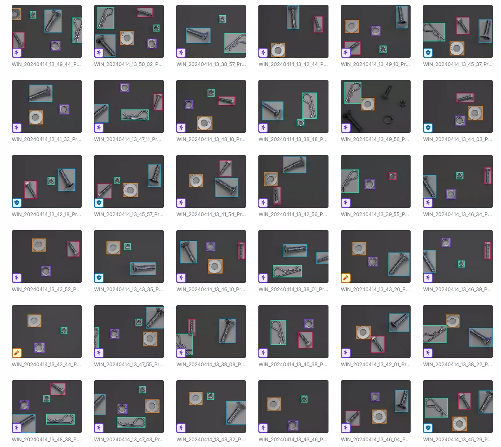
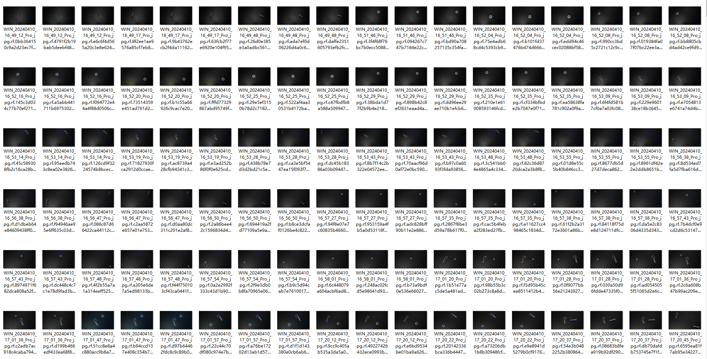
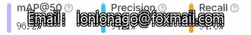
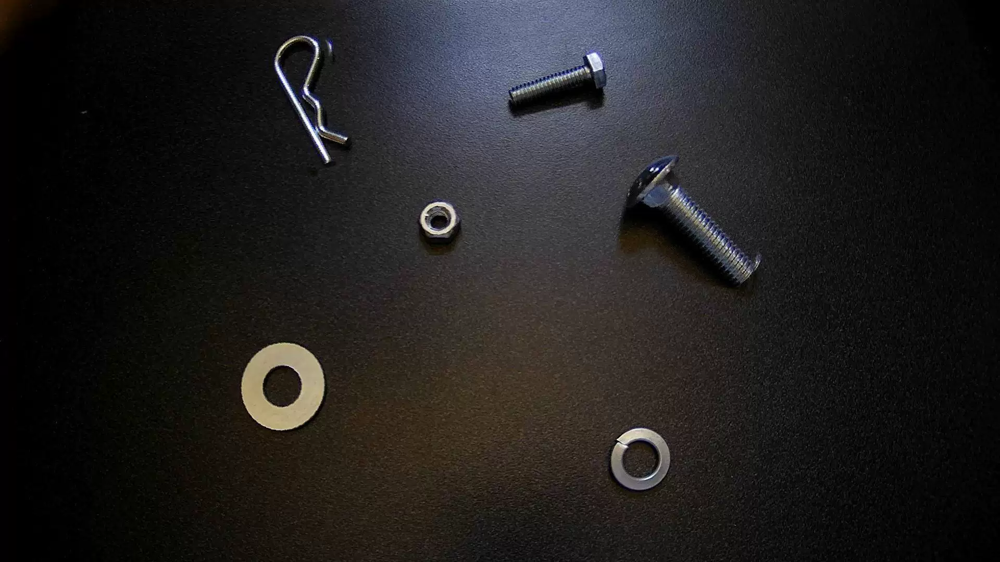
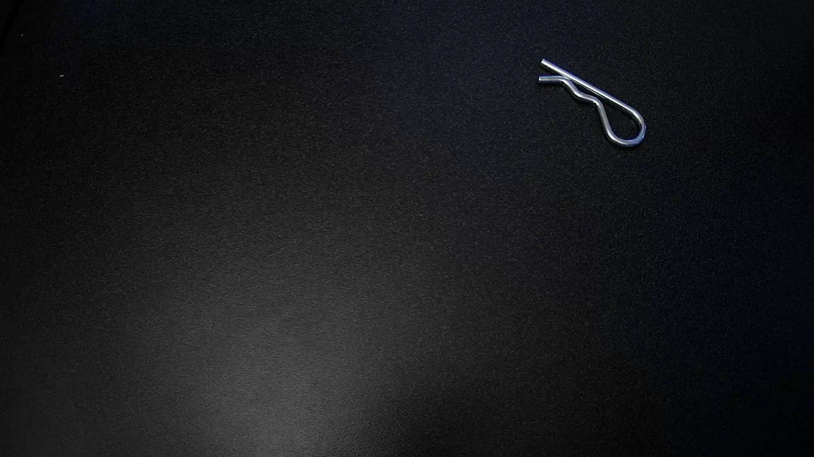
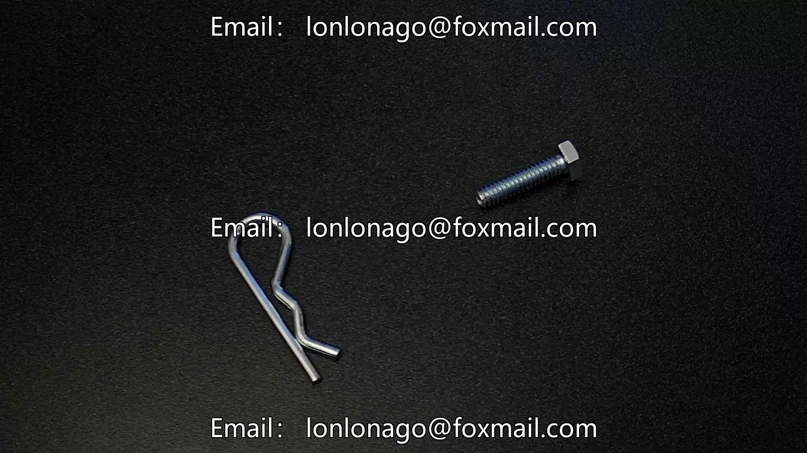
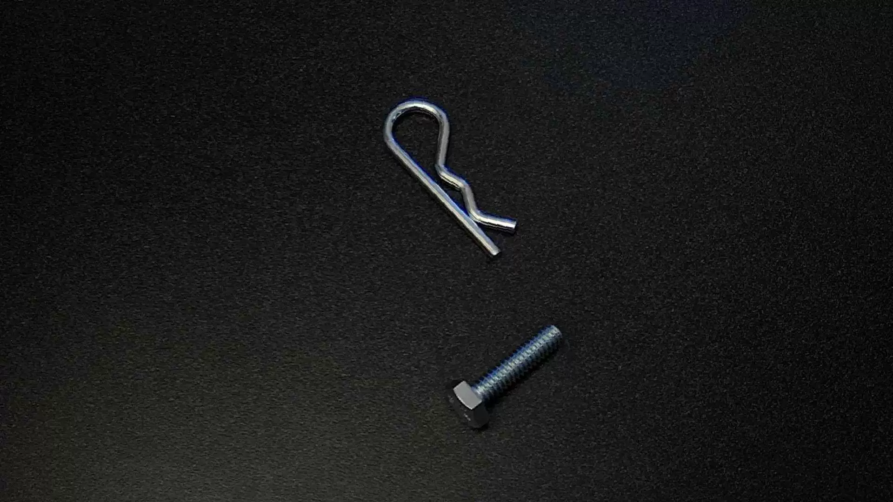

## Body

YOLO formatted dataset for target detection of nuts, axle bolts, flat washers, and slotted washers.

Total 825 images, labeled with tags, and divided into training set, test set, and validation set.

6 categories: CarriageBolt', 'FlatWasher', 'HexBolt', 'Nut', 'Rclip', 'SplitWasher'

"axle bolt", "flat washer", "hex bolt", "nut", "rclip", "split washer"

Electronic virtual products sold are non-returnable.

## Images

item_1044440750055

Here is a pay link on Stripe ( https://buy.stripe.com/3cs8yP7sY87d0vu9AB ). Please contact me lonlonago@foxmail.com after funding $89, and I will send you a complete data files , thank you!

